<h2 align="left">Leonardo León 👨‍💻</h2>
<h3 align="left">Backend Developer · Python · DevOps · Banking Systems · AI Integration</h3>

  <em>Building production-grade financial tools and automation systems — one project at a time.</em>

  
  
  
   
  
  
  
  

  

  

## 🏦 Fintech & Banking Portfolio

> A structured series of 8 production-inspired projects targeting Backend, DevOps, and AI roles in financial environments.

| # | Project | Stack | Highlights |
|---|---------|-------|------------|
| 1 | [TX-Classifier](https://github.com/korearn/tx-classifier) | Python · SQLite · LMStudio | NLP transaction categorization |
| 2 | [Bank Reconciliation](https://github.com/korearn/bank-reconciliation) | Python · Pandas · Bash | Automated discrepancy detection |
| 3 | [Exchange Rate API](https://github.com/korearn/exchange-rate-api) | FastAPI · SQLite · Docker | REST microservice with cache |
| 4 | [Infra Monitor](https://github.com/korearn/infra-monitor) | psutil · Bash · LMStudio | AI-powered system monitoring |
| 5 | [ETL Pipeline](https://github.com/korearn/etl-pipeline) | PostgreSQL · Pandas · Cron | Financial & weather data pipeline |
| 6 | [Credit Scoring API](https://github.com/korearn/credit-scoring-api) | scikit-learn · FastAPI · LMStudio | ML scoring with XAI |
| 7 | [Financial RAG Assistant](https://github.com/korearn/financial-rag) | ChromaDB · sentence-transformers · LMStudio | Document Q&A with RAG |

---

### ✅ [TX-Classifier — Transaction Classifier](https://github.com/korearn/tx-classifier)
**Automatic NLP-based bank transaction categorization using local LLMs**
`Python` `SQLite` `LMStudio` `Pandas` `Rich` `Prompt Engineering`
- Classifies bank transactions from CSV using a local LLM (Qwen2.5 / Gemma 3) via LMStudio
- Stores results in SQLite with category analytics via SQL aggregations
- 100% private — no external APIs, no data leaves the machine

### ✅ [Bank Reconciliation — Automated Reconciliation](https://github.com/korearn/bank-reconciliation)
**Automated bank-to-internal records reconciliation with Bash orchestration**
`Python` `Pandas` `Bash` `Cron` `WSL` `Rich`
- Detects 3 types of discrepancies: amount mismatches, missing bank records, missing internal records
- Bash script with pre-flight checks, logging and exit codes
- Configurable as a daily cron job for fully automated execution

### ✅ [Exchange Rate Microservice](https://github.com/korearn/exchange-rate-api)
**REST API for real-time currency conversion with caching and fallback**
`Python` `FastAPI` `SQLite` `Pydantic` `Docker` `Uvicorn`
- 5 REST endpoints with automatic Swagger documentation via FastAPI
- SQLite cache with configurable TTL to reduce external API calls
- Automatic fallback rates when Frankfurter API is unavailable
- Dockerfile included for portable containerized deployment

### ✅ [Infra Monitor — Infrastructure Monitor with AI](https://github.com/korearn/infra-monitor)
**Real-time system monitoring daemon with LLM-powered diagnostics**
`Python` `psutil` `Bash` `SQLite` `LMStudio` `Rich`
- Monitors CPU, RAM, disk and network every N seconds (configurable)
- Detects anomalies against configurable thresholds with cooldown pattern
- Generates natural language diagnostics using a local LLM via LMStudio
- Bash scripts for daemon control (start/stop/status) with PID management

### ✅ [ETL Pipeline — Financial & Weather Data](https://github.com/korearn/etl-pipeline)
**Automated ETL pipeline extracting financial and climate data into PostgreSQL**
`Python` `PostgreSQL` `Pandas` `Frankfurter API` `Open-Meteo API` `Bash` `Cron`
- Extracts historical exchange rates and weather data from free public APIs
- Transforms and cross-joins both sources into a unified daily summary table
- Idempotent upsert pattern — safe to run multiple times without duplicates
- Structured logging with timestamps and daily cron job automation

### ✅ [Credit Scoring API](https://github.com/korearn/credit-scoring-api)
**ML-powered credit scoring with AI-generated explanations**
`Python` `FastAPI` `scikit-learn` `SQLite` `LMStudio` `Pydantic`
- Random Forest model trained on 5,000 synthetic profiles to predict default probability
- Converts default probability to 300-850 credit score scale with risk categorization
- Local LLM generates personalized natural language explanations for each decision
- Full audit trail in SQLite — every scoring decision logged for regulatory compliance

### ✅ [Financial RAG Assistant](https://github.com/korearn/financial-rag)
**Document Q&A system using RAG with local embeddings and LLM**
`Python` `FastAPI` `ChromaDB` `sentence-transformers` `LMStudio` `pypdf`
- Indexes financial PDF documents into ChromaDB as semantic vector embeddings
- Retrieves relevant fragments by semantic similarity, not keyword matching
- Generates answers using a local LLM grounded exclusively in your documents
- Supports multilingual queries — automatically detects question language

---

## 🚀 Other Projects

### [🐍 Python Zero to Hero](https://github.com/korearn/python-zero-to-hero)
**Structured journey to Python mastery**
`Python 3` `Algorithms` `Data Structures` `OOP`
- Core concepts implemented with Pareto Principle approach
- Real-world mini-projects and logic exercises

### [SRE Learning Path](https://github.com/korearn/sre-learning-path)
**Production-ready log analyzer with full DevOps pipeline**
`Python` `Flask` `Kubernetes` `Docker` `Terraform`
- Containerized application with health checks and auto-scaling
- Infrastructure as Code integration

### [SQL Database Practice](https://github.com/korearn/sql-practice)
**Database management and query optimization**
`SQL` `SQLite` `Database Design`
- Complex queries, schema normalization, and performance tuning

---

## 🛠️ Technical Stack

### 💻 Backend & Programming

  
  
  
  
  
  
  
  
  
  
  
  
  

### 🤖 AI & Data

  
  
  
  
  

### 🔧 Cloud & Infrastructure

  
  
  
  
  
  
  
  
  
  
  

---

## 📈 Current Focus

- **Fintech Portfolio** — building a series of 8 production-inspired banking and AI projects
- **Local AI Integration** — connecting LLMs (Qwen, Gemma, Deepseek) to real backend systems via LMStudio
- **Backend Architecture** — REST APIs, microservices, and data pipelines with Python
- **DevOps Automation** — Bash scripting, cron jobs, and Linux system automation

---

## 📊 GitHub Activity
<picture>
  <source media="(prefers-color-scheme: dark)" srcset="https://raw.githubusercontent.com/korearn/leonardoleon/output/github-snake-dark.svg" />
  <source media="(prefers-color-scheme: light)" srcset="https://raw.githubusercontent.com/korearn/leonardoleon/output/github-snake.svg" />
  
</picture>

 

---

## 📫 Let's Connect

  
  

